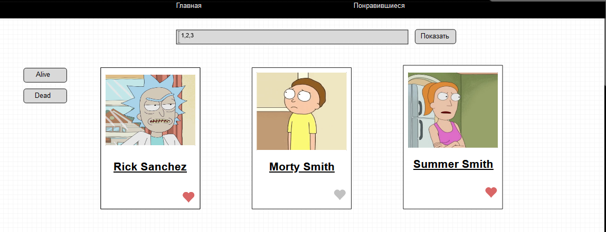
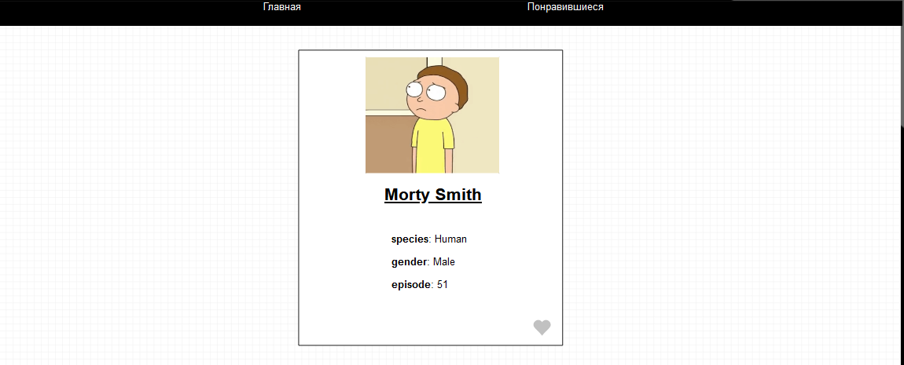

Привет, я реализовал приложение для работы с API "Рик и Морти".

На главной странице присутствует инпут, в который через запятую пользователь вводит id персонажей которых хочет получить.
Пример как получить персонажей с id 1, 2, 3 : `https://rickandmortyapi.com/api/character/1,2,3`

После того, как будет нажата кнопка "Показать" на странице должны появиться карточки персонажей.

Карточка содержит аватарку и имя, кликнув по имени мы переходим на детальное представление о персонаже.

Также пользователь может лайкнуть персонажа, и все кто ему нравятся должны отобразиться на отдельной странице "Понравившиеся".

На главной странице можно ввести другие id, но данные о лайках не должны пропасть и, если будут встречаться понравившиеся герои, то
иконка с сердечком должна быть красного цвета.

Если, мы хотим знать жив герой или нет, то при нажатии на кнопку "Alive" или "Dead" карточки с соответствующм статусом должны быть выделены другим цветом.
